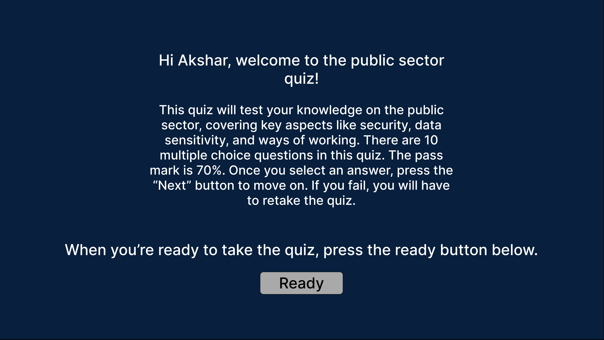
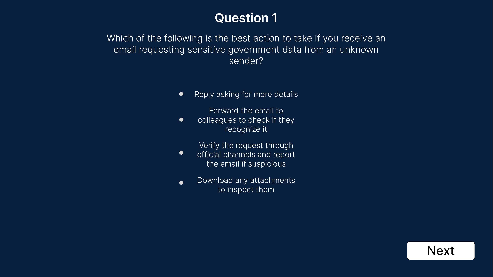
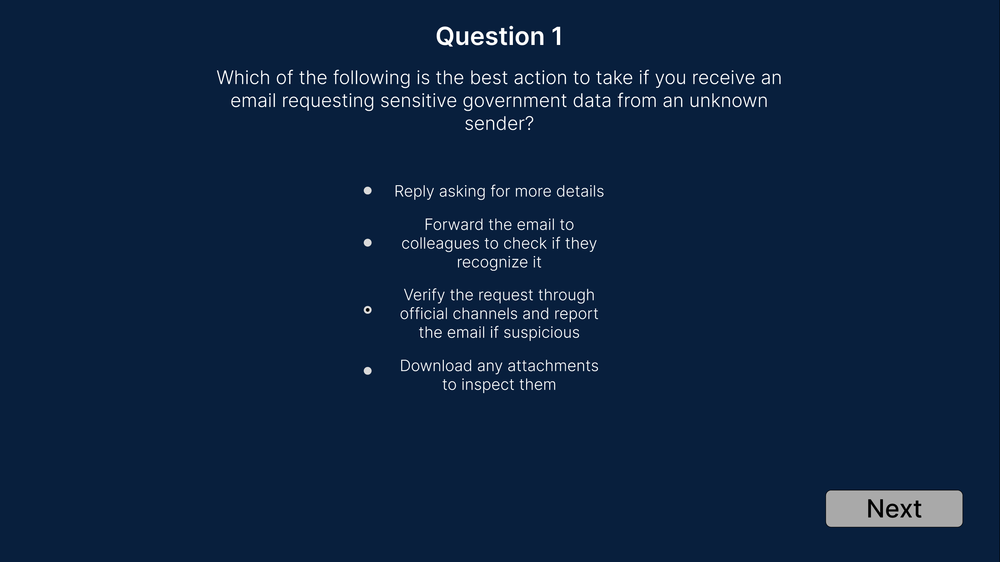
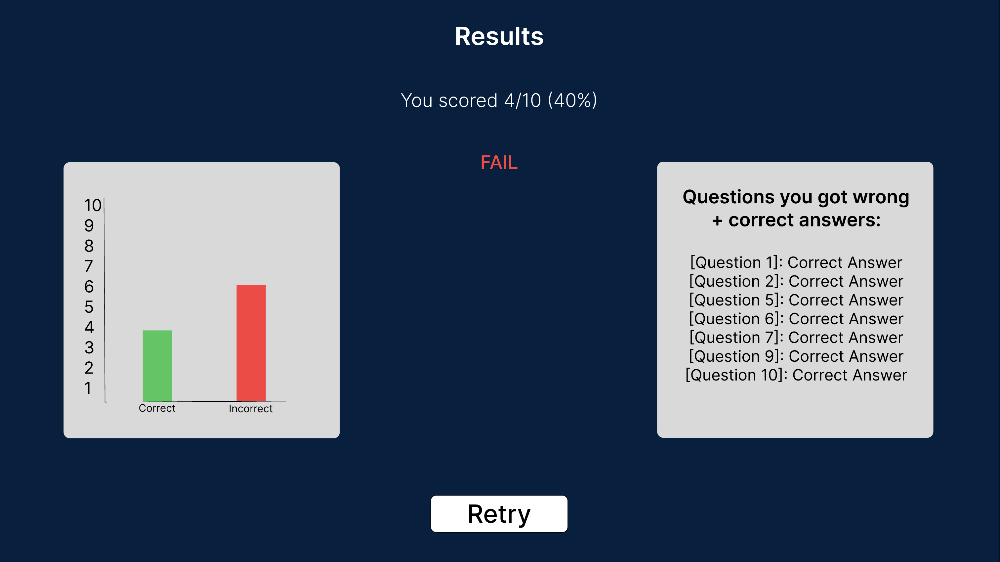
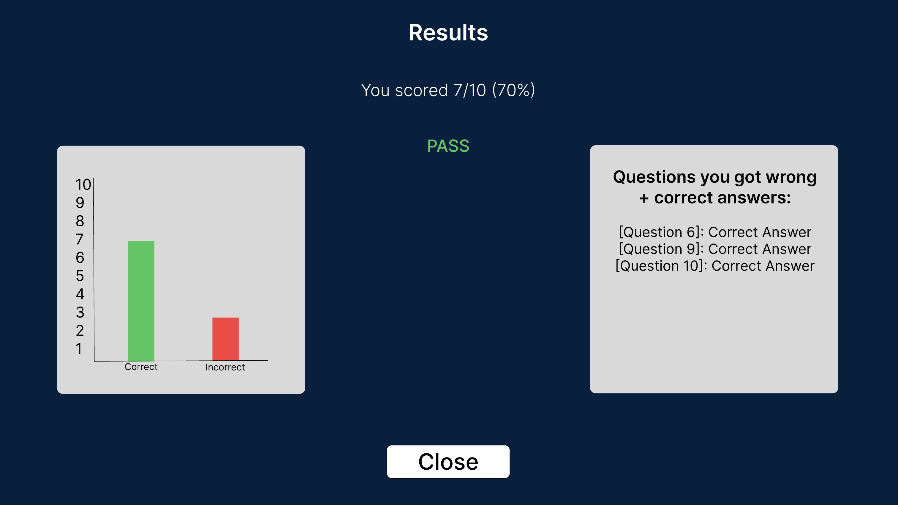
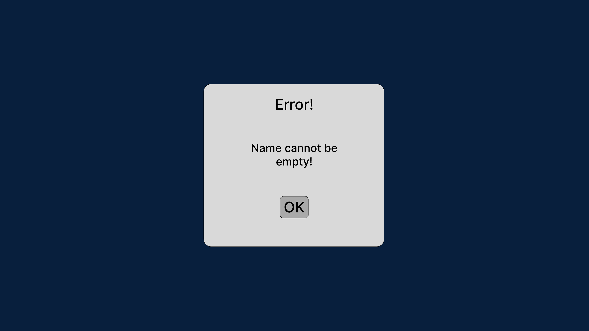
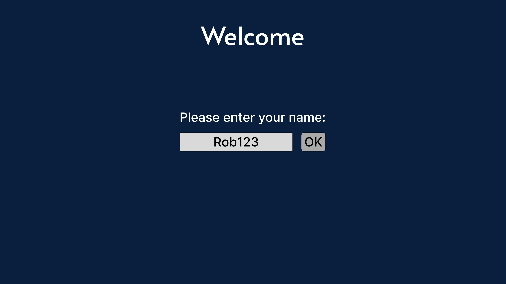
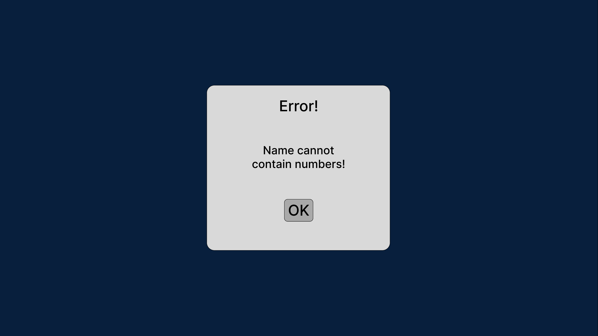
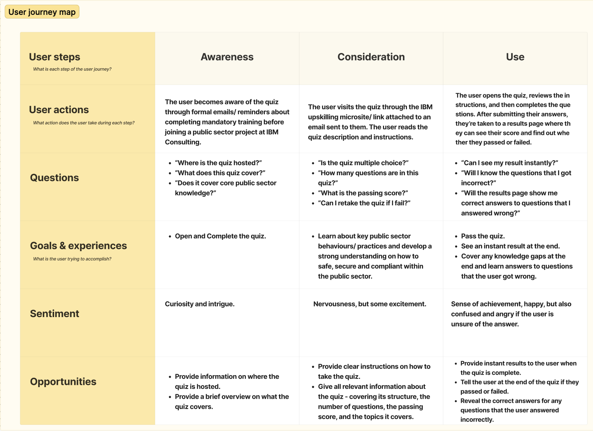
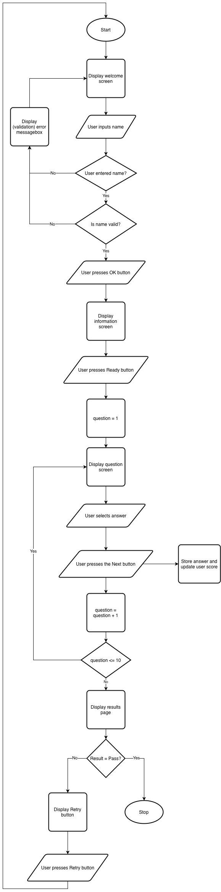

# public-sector-quiz-app-summative-two-ifcs
A Quiz Application Developed Using Streamlit and Python. Tests knowledge on the public sector, covering key topics such as security and data sensitivity.

## Introduction
Working as a degree apprentice within IBM Consulting involves solving problems and delivering technological solutions to clients. As a data scientist on a public sector consulting project, I am working in an environment where security, data sensitivity, and integrity are critical. In this type of work environment, employees are expected to maintain strong awareness of strict organisational procedures/ policies, ethics and operational expectations. This helps keep the public sector secure and prevents any official sensitive data from being exploited or leaked.
However, serious incidents can occur when employees accidentally expose confidential public sector information due to knowledge gaps regarding organisational policies and consequences.
Hence, I am developing a quiz application which will test the core knowledge of employees entering/ working in the public sector through a multiple-choice quiz. The quiz will have 10 questions covering crucial topics like cybersecurity and data sensitivity. The purpose of this quiz will be to test the "must-have"/ essential knowledge of public sector practices and identify any employee knowledge gaps. As a result, the quiz can also be used to reinforce knowledge of core public sector behaviours and strengthen any weak points of knowledge. To summarise, this application is designed with the intention of mitigating public sector incidents through proper education and quizzing.
I will be using Python and the Streamlit framework to develop my application as a minimum viable product (MVP). Developing an MVP will allow me to implement and validate core functionality quickly. Alongside rapid development, having an MVP will enable smoother application scaling in the future.

**Key features of my MVP application include:** <br>
-10 Multiple-choice questions <br>
-A CSV file to store pre-defined questions + answers <br>
-Input validation <br>
-Results screen showing score, pass/fail rating and visualisations. <br>

When developed, my quiz will act as a model/ proof-of-concept for how training courses and learning plans could be structured to help current employees and new joiners develop awareness of organisational policies and operations.


## Design

### GUI Designs:

Below are Figma designs of the Graphical User Interface (GUI) of my quiz application.
The user interface design is simple and linear user journey designed to make the quiz easy to understand and navigate. The flow comprises the following screens:


*Screen 1: Welcome screen. This is the first page that the user sees when they load up the quiz. It has an input box for the user to enter their name and an OK button.*



*Screen 2: Instructions screen. This is the next page that the user sees. This screen displays information about the quiz structure, the number of questions, the pass mark, and the assessed topics. There is a ready button to start the questions.*


*Question Screens: Every question is presented on a new screen. The question is at the top with the multiple choice answers underneath. Next to each option, there is a small circle which can be clicked to finalise the answer. At the bottom, there's a "Next" button which takes the user to the next question.*




*Screen 4: Results Page. This displays the user's score along with a pass or fail rating. Visualisations are also displayed which show the number of correct and incorrect questions. This page also displays the incorrectly answered questions along with correct responses. A 'Retry' button is presented to those who fail.*



*Below are screen designs for handling invalid user inputs (unhappy pathway):*



*Error Messagebox (Empty name field). If the user leaves the name field empty, this error messagebox is displayed.*




*Error Messagebox (Invalid Characters). If the user inputs invalid characters in the name field, this error messagebox is displayed.*

Figma Designs Prototype Link: <br>
```https://www.figma.com/proto/8pMmDQwf51MyWRiGa8xm4e/Summative-2-Quiz-Design?node-id=0-1&t=DFJ5UlcQQq93g9qx-1```

<br>

### User Journey Map:


<br>

### Quiz Flowchart - User Journey:
The following diagram displays the flow of the application from start to finish and helps visualise the journey that users take when they interact with the program. It shows the different pathways of the application based on certain conditions or situations.



<br>

### Functional and Non-Functional Requirements:
Functional Requirements (FR) define what the application must do, guiding the development of specific features and functionality.
Non-Functional requirements (NFR) define key attributes of the application such as usability and maintainability, guiding effective and efficient development.

<br>

**Functional Requirements (Data) Table:**

| ID   | Requirement                                                                 | Category              |
|------|-----------------------------------------------------------------------------|---------------------------------|
| FR1  | System must display "Welcome" screen when quiz application is run          | User Interface/ User Flow      |
| FR2  | System must allow users to enter name                                       | Input                           |
| FR3  | System must validate name input                                            | Input Validation                |
| FR4  | System must display screen with custom welcome message and quiz information | User Interface/ Output         |
| FR5  | System must read 10 questions and multiple-choice answers from CSV file    | Data Management                 |
| FR6  | System must display one question at a time and present all multiple choice answers to user | User Interface/ Output |
| FR7  | System must allow user to select one multiple-choice answer                | Input                           |
| FR8  | System must track live user score                    | Scoring Mechanism/ Data Management |
| FR9  | System must track and store (write) all user scores (historical)                    | Scoring Mechanism/ Data Management |
| FR10 | System must track and keep a list of incorrectly answered questions in CSV file | Data Management/ Scoring |
| FR11 | System must detect all button clicks and respond appropriately             | User Interface/ Output         |
| FR12 | System must calculate pass/ fail rating based on user score              | Scoring/ Data Management       |
| FR13 | System must display "Results" screen at the end and output a final score accompanied by a pass/ fail rating | User Interface/ Output |
| FR14 | System must output score visualisations and incorrectly answered questions along with their correct responses on the "Results" page | User Interface/ Output |
| FR15 | System must display a "Retry" button on the "Results" page for users who fail the quiz | User Interface/ Output |
<br>

**Non-Functional Requirements (Data) Table:**

| ID   | Requirement                                                                 | Description + Justification              |
|------|-----------------------------------------------------------------------------|---------------------------------|
| NFR1  | Clear User Interface          | The UI must be well-organised with easily understandable layouts. Each screen must have consistent spacing between elements, and buttons must be noticeable. This reduces user errors and makes the application easy to interact with.     |
| NFR2  | Usability                                       | The application must be simple, easy to understand, yet intuitive. This makes the quiz easy to use and suitable for users from different backgrounds.                           |
| NFR3  | Accessibility                                            | The application must be simple. Text must be readable through appropriate font size. The colour scheme should be high contrast. UI elements must be clearly visible. This makes the application easily accessible to users with difficulties like blurry vision and colour blindness.                |
| NFR4  | Performance and Fast Response Times | The questions must be displayed instantly to the user as well as the end results. There must be no visible delay in these processes. This improves the user experience.         |
| NFR5  | Maintainability    | Code must be structured using the OOP (object-oriented programming) paradigm and pure functions. Code must follow standard Python conventions. This supports future modifications and development.                |
| NFR6  | Reliable data storage  | The quiz should store and track user progress/ scores without crashing. This prevents the loss of results. |
| NFR7  | Portability                | The application must run on all devices which have Python and the required dependencies installed. This allows users to take the quiz from any machine. |
<br>

### Tech Stack Outline
Programming Language: Python <br>
GUI toolkit: Streamlit <br>
Data Storage (questions, answers and scores): CSV files <br>
Testing: pytest framework <br>
Version Control: GitHub <br>
Continuous Integration (CI/CD): GitHub Actions - Python Application <br>

### Code Design - OOP

                    +------------------+
                    |     Question     |
                    +------------------+
                    | question_number  |
                    | question_text    |
                    | answer_a         |
                    | answer_b         |
                    | answer_c         |
                    | answer_d         |
                    | correct_answer   |
                    +------------------+

                             ▲
                             |
                             | contains
                             |
                    +------------------+
                    |       Quiz       |
                    +------------------+
                    | questions        |
                    +------------------+
                    | load_questions() |
                    +------------------+


+------------------+      +------------------+
| WelcomeScreen    |      |   InfoScreen     |
+------------------+      +------------------+
| render()         |      | render()         |
+------------------+      +------------------+

          \                    /
           \                  /
            \                /
             \              /
              ▼            ▼

          +---------------------+
          |   QuestionScreen    |
          +---------------------+
          | quiz                |
          +---------------------+
          | render()            |
          +---------------------+

                     |
                     ▼

          +---------------------+
          |   ResultsScreen     |
          +---------------------+
          | render()            |
          | reset_quiz()        |
          +---------------------+

                     |
                     ▼

          +---------------------+
          |   ResultManager     |
          +---------------------+
          | file_path           |
          +---------------------+
          | save_result()       |
          | load_results()      |
          +---------------------+


## Development

### Object-Oriented Programming:
```python
class Question:
    """
    Class for modelling a single quiz question.
    """

    def __init__(self, question_number, question_text, answer_a, answer_b, answer_c, answer_d, correct_answer):
        """
        Creates the Question object and initialises its values.
        """

        self.question_number = question_number
        self.question_text = question_text
        self.answer_a = answer_a
        self.answer_b = answer_b
        self.answer_c = answer_c
        self.answer_d = answer_d
        self.correct_answer = correct_answer
```

A major part of my application design is object-oriented programming (OOP). The class, "Question", is a strong example of OOP. This class models a single question in the quiz.
Classes are a fudamental concept as they allow for modular and maintainble code which can be reused as a blueprint. Classes also allow for security/ data protection since they encapsulate the data within them. This class is used as a framework to create the multiple choice questions for my quiz. It comprises core question attributes and initialises them, e.g. question_number. This allows me to consistently create 10 reliable, multiple choice question for my quiz using the data in my questions.csv file.


### Streamlit User Interface:
```python
st.set_page_config(
     page_title="Public Sector Quiz",
     layout="centered"
)

load_css()

quiz = Quiz("data/questions.csv")

if "screen" not in st.session_state:
    st.session_state.screen = "welcome"

if st.session_state.screen == "welcome":
    WelcomeScreen().render()

elif st.session_state.screen == "info":
    InfoScreen().render()

elif st.session_state.screen == "quiz":
    QuestionScreen(quiz).render()

elif st.session_state.screen == "results":
    ResultsScreen().render()
```

Alongside Python, Streamlit has been used as the GUI framework to develop the interactive user interface of my application. The code above uses Streamlit to control the UI and manage navigation between different screens of my quiz. Integrated into conditional statements, the session state variables store the user's current (UI) screen so that relevant information is rendered and output to the user. This functionality creates a multi-screen user experience. The modularity also improves code readability and makes each screen independent.


### Pure, Testable Functions:
```python
def calculate_percentage(score, total_questions):
        """
        Pure function - calculates quiz percentage.
        """

        return int((score/ total_questions) * 100)
```

```python
def validate_name_input(name):
    """
    Validates the name input.

    Returns:
        tuple(bool, str)
    """

    name = name.strip()

    if not name:
        return False, "Name cannot be empty!"
    elif re.search(r"\d", name):
        return False, "Name cannot contain numbers!"
    elif not re.fullmatch(r"[A-Za-z\s\-]+", name):
        return False, "Name can only contain letters, spaces and dashes!"
    else:
        return True, ""
```

The codebase contains pure functions so code becomes readable and easily testable. A pure function has no side affects and always returns the same output for a given input. calculate_percentage() is a pure function that takes the user's final score and calculates the percentage of questions they got correct. validate_name_input() is another pure function that takes the user's name and validates it against predefined patterns. Automated tests can be run on these functions as they are independent and don't affect other code. Having pure functions allows me to conduct quality assurance and test my code using pytest.


### Input Validation:
```python
import re

def validate_name_input(name):
    """
    Validates the name input.

    Returns:
        tuple(bool, str)
    """

    name = name.strip()

    if not name:
        return False, "Name cannot be empty!"
    elif re.search(r"\d", name):
        return False, "Name cannot contain numbers!"
    elif not re.fullmatch(r"[A-Za-z\s\-]+", name):
        return False, "Name can only contain letters, spaces and dashes!"
    else:
        return True, ""
```

Input Validation is another crucial element of my application; preventing invalid user input from entering the system's database. This improves data quality, consistency, and the reliability of my quiz.
The name input is validated to prevent blank entries, or prevent data with numbers/ special characters from being entered. The regex module enforces validation, checking if the name matches a certain pattern ```(r"[A-Za-z\s\-]+")```. This improves usability while mitigating unexpected behaviour.


### CSV Storage and Data Management:
```python
class ResultManager:
    """
    Manages quiz result storage.
    """

    def __init__(self, file_path):
        """
        Stores the CSV file path.
        """

        self.file_path = file_path


    def save_result(
            self,
            name,
            score,
            percentage,
            result
        ):
            """
            Saving one quiz's result to CSV.
            """

            try:
                with open(self.file_path, mode="a", newline="", encoding="utf-8") as file:
                    writer = csv.writer(file)

                    writer.writerow(
                        [
                            name,
                            score,
                            percentage,
                            result,
                            datetime.now().strftime(
                                "%Y-%m-%d %H:%M:%S"
                            )
                        ]
                    )

            except Exception as error:
                print(
                    f"Error saving result: {error}"
                )
```

```python
def render(self):
        """
        Renders results screen.
        """
        
        score = st.session_state.score
        total_questions = 10

        percentage = calculate_percentage(score, total_questions)
        passed = score >= 7
        result_text = "PASS" if passed else "FAIL"

        if "result_saved" not in st.session_state:
            manager = ResultManager(
                "data/scores.csv"
            )

            manager.save_result(
                st.session_state.name,
                score,
                percentage,
                result_text
            )

            st.session_state.result_saved = True
        

        st.title("Results")

        st.subheader(
            f"You scored {score}/{total_questions} ({percentage}%)"
        )

        if passed:
            st.success("PASS")
        else:
            st.error("FAIL")

        st.divider()

        st.subheader(
            "Questions you got wrong + correct answers:"
        )

        if len(st.session_state.incorrect_questions) > 0:
            for item in st.session_state.incorrect_questions:
                st.write(
                    f"**{item['question']}**"
                )
                st.write(
                    f"Correct Answer: {item['correct_answer']}"
                )
                st.write("---")

        st.divider()

        chart_data = pd.DataFrame({"Answers": ["Correct", "Incorrect"], "Count":[score, total_questions-score]})
        
        st.subheader("Performance")

        st.bar_chart(
            chart_data.set_index("Answers")
        )

        st.divider()

        if not passed:
            if st.button("Retry"):
                self.reset_quiz()
                st.rerun()
        else:
            st.success(
                "Congratulations! You passed."
            )
```

My application uses CSV files to persistently store quiz results. The "ResultManager" class manages this reading and writing of quiz data. The class takes in a CSV file for storage, using it to record the user's name, score, percentage, result, and timestamp for each quiz attempt. This implementation ensures that historical results/ data is saved permanently, making it accessible in the future. The code also renders a results screen, displaying the user’s score, incorrect answers, and a retry button (conditionally).


### Exception Handling:
```python
try:
            with open(self.file_path, mode="a", newline="", encoding="utf-8") as file:
                writer = csv.writer(file)

                writer.writerow(
                    [
                        name,
                        score,
                        percentage,
                        result,
                        datetime.now().strftime(
                            "%Y-%m-%d %H:%M:%S"
                        )
                    ]
                )

        except Exception as error:
            print(
                f"Error saving result: {error}"
            )
```

Exception handling was implemented when reading & writing CSV files. This prevents the app from crashing if the file is missing/ inaccessible. My handler uses try and except blocks, placing the CSV writer functionality within the try block, and placing the custom error message in the except block. The try block runs first. If an error occurs, the except block is executed, printing the raised error. This improves application robustness & reliability.


## Testing -2329
My testing strategy was focussed around rigourous application testing and quality assurance. The process was guided using the functional requirements and non-functional requirements of my application, and it comprises of the following test methodologies: <br><br> 1. Manual testing <br> 2. Unit/ Automated testing <br> 3. Smoke testing <br> 4. Integration testing <br> 5. Regression testing through a continuous integration pipeling on GitHub.x

### Testing Techniques - Application, Justification
Below are the various testing methodologies that I've used to test different parts of my application and my reasons for using them.
1. Unit Testing (Automated) - I've used automated tests to test the small units of my applications - particularly the (pure) functions within my codebase. Functions perform specific tasks and to make sure they work as expected, unit tests can be run on them. For example, the function "calculate_percentage()" To test is i've got a uni tet
2. Smoke Testing - I've written smoke tests at the start of both of my test files to ensure that my testing framwork is imported and works as expected. By writing smoke tests, I am able to make sure that my testing framework is functional before I write any deeper tests which test the actual codebase and program functionality.  For 